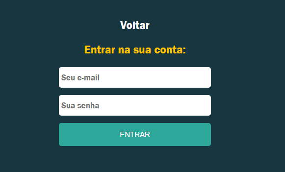
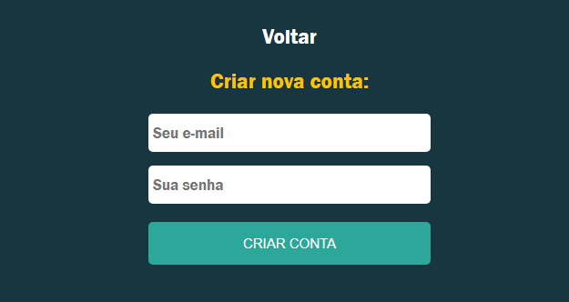

Este sistema é um mural de recados com limite de 150 caracteres. Tem como principais tecnologias ReactJs com hooks e NodeJs.  
Este projeto tem como destaque a utilização do hook useContext para compartilhamento de dados de login do usuário entre os componentes.  
Dessa forma é possível que cada comentário tenha a identificação de cada usuário.  
O Firebase foi utilizado como backend da aplicação, auxiliando com o sistema de login e armazenamento de comentários.  

O projeto pode ser acessado pelo link a seguir: https://comentakiprojeto.web.app/. 
Para acesso no modo de desenvolvimento, execute npm start no diretório raiz do projeto. 
Temos abaixo a tela inicial do sistema:   
  

Após clicar no botão "Entrar", o usuário é direcionado para a tela de login:   
  
Para teste, acesse o usuário a seguir:   
Email: rodrigo@gmail.com  
Senha: abc123   

Ao acessar a opção "Criar Conta", o usuário deverá criar seu acesso pela tela a seguir:  
  

O campo para comentar só fica disponível após fazer login:   
   

Um botão para excluir o comentário ficará disponível somente no comentário feito pelo respectivo usuário que comentou. No exemplo abaixo, o Rodrigo está logado e somente em seu comentário está disponível o botão para excluir.   
   

Segue a versão responsiva da aplicação:  
  

